# Crunchy Database Deployment Workflow via GitHub Actions

This GitHub Actions workflow automates the deployment and management of a Crunchy PostgreSQL database instance within an OpenShift environment. It's designed to support application development workflows, particularly by providing isolated database instances for Pull Requests and ensuring resources are cleaned up afterwards.

## Features

- **PostgreSQL Support** with PostGIS extensions (optional)
- **High Availability** configuration with multiple replicas
- **Backup & Recovery** options using both PVC and S3 storage
- **PR-based Isolated Databases** for development workflows
- **Automatic Resource Cleanup** when PRs are closed
- **Monitoring Integration** with Prometheus

## Workflow Overview

Here's a breakdown of the main phases:

### Generate Release Name 
*   This step is <b><u>executed only</u></b> when input `release_name` optional parameter is not supplied, which is the default way.
*   This initial step creates a unique identifier for the Crunchy database deployment.
*   It takes the repository name and generates a short hash from it, prefixing it with `pg-`. This ensures deployments are named consistently but uniquely per repository, which is helpful in a shared OpenShift namespace.
*   The generated name is then used in subsequent steps to reference the specific Crunchy cluster.

### Deploy Database

*   This is the core deployment step, utilizing the `bcgov/action-oc-runner` action to interact with the target OpenShift cluster.
*   It prepares a Crunchy Helm chart (adjusting the name in `Chart.yaml`) and packages it.
*   It then uses `helm upgrade --install` to deploy or update the Crunchy PostgreSQL cluster.
*   **Importantly**, it includes logic to conditionally enable and configure S3 backups based on provided inputs.
*   Post-deployment, the workflow includes a wait loop that checks the status of the Crunchy cluster's primary database instance (`db`) to ensure it becomes ready before proceeding. This confirms the operator has successfully provisioned the database.

### Add PR Specific User (Conditional)

*   This step only runs when the workflow is triggered by a Pull Request.
*   Its purpose is to create a dedicated PostgreSQL user and a corresponding database within the deployed Crunchy cluster specifically for that Pull Request (named `app-<PR_number>`).
*   It works by patching the `PostgresCluster` OpenShift resource to add the new user to its specification. The Crunchy operator then sees this change and provisions the user and database.
*   A waiting mechanism is included to ensure the corresponding Kubernetes `Secret` containing the user's credentials is created by the operator before the step finishes. This dedicated user/database setup helps in isolating development environments for different PRs.

### Cleanup Job

*   This separate job is designed to remove resources created by the workflow. It's triggered when a Pull Request is closed or merged, or when the `force_cleanup` input is set to true.
*   For the Crunchy deployment, it identifies the specific `PostgresCluster` based on the generated release name.
*   It then removes the PR-specific user from the `PostgresCluster` definition by patching the resource.
*   Finally, it connects to the primary PostgreSQL pod using `oc exec` and executes `psql` commands to terminate existing connections to the PR database, and then drops both the dedicated PR database and the PR user role within PostgreSQL.
*   This cleanup is essential for managing resources and preventing resource sprawl when using PR-based deployments.

```mermaid
%%{
    init: {
        'theme': 'base',
        'themeVariables': {
            'primaryColor': '#f8f8f8',
            'primaryTextColor': '#333',
            'primaryBorderColor': '#ddd',
            'lineColor': '#666',
            'secondaryColor': '#eee',
            'tertiaryColor': '#fff'
        },
        'flowchart': {
            'curve': 'basis'
        }
    }
}%%
graph TD
        subgraph "Deployment Phase"
                A[Start]
                B(Generate Release Name);
                C(Deploy Database using Helm);
                D{Wait for Primary DB Ready};
                E{Is this a PR Trigger?};
                F(Add PR Specific User/DB);
                G(Wait for User Secret);
                H(Deployment Complete);

                B --> C;
                C --> D;
                D --> E;
                E -- Yes --> F;
                F --> G;
                G --> H;
                E -- No --> H;
        end

        subgraph "Cleanup Phase (PR Close)"
                I[Start Cleanup];
                J(Identify PostgresCluster);
                K(Patch PostgresCluster - Remove PR User);
                L(Connect to Primary Pod);
                M(Terminate Connections to PR DB);
                N(Drop PR Database);
                O(Drop PR User Role);
                P[Cleanup Complete];

                I --> J;
                J --> K;
                K --> L;
                L --> M;
                M --> N;
                N --> O;
                O --> P;
        end

        A --> B;

        classDef default fill:#f9f9f9,stroke:#333,stroke-width:1px;
        classDef condition fill:#fffbe6,stroke:#ffe58f,stroke-width:1px;
        classDef action fill:#e6fffb,stroke:#87e8de,stroke-width:1px;
        classDef wait fill:#fff7e6,stroke:#ffd591,stroke-width:1px;
        classDef startEnd fill:#f0f0f0,stroke:#555,stroke-width:2px,font-weight:bold;

        class A,I,H,P startEnd;
        class E condition;
        class B,C,F,J,K,L,M,N,O action;
        class D,G wait;
```



## Configuration Options

The action accepts the following inputs:

### Required Inputs

| Input | Description |
|-------|-------------|
| `oc_namespace` | OpenShift namespace where the database will be deployed |
| `oc_token` | OpenShift token for authentication |

### Optional Inputs

| Input | Description | Default |
|-------|-------------|---------|
| `values_file` | Path to a values.yml file in the calling repository; omit to use the bundled [values.yml](values.yml). Cannot be combined with the override inputs | |
| `pvc_size` | Override: data volume size, e.g. `1Gi` | |
| `storage_class` | Override: data volume storage class | |
| `postgres_version` | Override: PostgreSQL major version, see [Supported PostgreSQL Versions](#supported-postgresql-versions) | |
| `replicas` | Override: number of PostgreSQL instance replicas | |
| `cpu_request` | Override: CPU request for PostgreSQL instances, e.g. `50m` | |
| `memory_request` | Override: memory request for PostgreSQL instances, e.g. `128Mi` | |
| `route_enabled` | Override: create a TLS passthrough Route to the primary database service, see [External Access](#external-access) | false |
| `route_host` | Override: Route host name; requires `route_enabled`, OpenShift generates one if omitted | |
| `environment` | Environment name (omit for PRs) | |
| `triggers` | Paths used to trigger a deployment (e.g., ./backend/ ./frontend/) | |
| `oc_server` | OpenShift server URL | https://api.silver.devops.gov.bc.ca:6443 |
| `s3_access_key` | S3 access key for backups | |
| `s3_secret_key` | S3 secret key for backups | |
| `s3_bucket` | S3 bucket for backups | |
| `s3_endpoint` | S3 endpoint for backups | |
| `dry_run` | `helm upgrade --dry-run=server --hide-secret` validates the chart against the OpenShift API, then the action exits without deploying, waiting, or changing PR users. Secret resources are omitted from the output | false |
| `force_cleanup` | Force cleanup of the database | false |
| `self_heal_stuck_releases` | Purge a Helm release stuck in a non-deployed state (`pending-*`, `failed`, `uninstalling`) before reinstalling. **Deletes the PostgresCluster and its data volumes** | false |
| `directory` | Chart directory inside `repository`; used only when `repository` is set | charts/crunchy |
| `repository` | Repository to take the chart from (e.g., org/repo); omit to use the chart bundled with this action | |
| `ref` | Git ref of `repository` (e.g., branch, tag, SHA); used only when `repository` is set | main |
| `release_name` | The release name to use, if provided overrides the computed pg-md5hash(1-8) of github repo name, if release_name is `pg-abc`,postgres cluster created will be `pg-abc-crunchy` | |
| `diff_branch` | The branch to diff against (if not using default branch) Optional | |
| `github_token` | (Optional) GitHub (built-in or PAT) token, otherwise inherited from workflow token | `github.token` |

### Outputs

| Output | Description |
|--------|-------------|
| `release` | The provided or generated release name |
| `cluster` | The name of the deployed cluster |
| `db_secret` | The secret name containing generated database credentials (`<cluster>-pguser-app[-<pr>]`) |
| `db_host` | The pgBouncer database hostname (`<cluster>-pgbouncer`) |
| `db_port` | The database port (`5432`) |
| `db_user` | The database user name (`app[-<pr>]`) |
| `db_name` | The database name (`app[-<pr>]`) |

### Overrides

Override inputs adjust the bundled values.yml; unset inputs keep the bundled values. They are mutually exclusive with `values_file`: combining them fails the run and names the conflicting inputs. Put those settings in the values file instead.

### Supported PostgreSQL Versions

`postgres_version` selects a known-good PostGIS image from the [bcgov/crunchy-postgres compatibility table](https://github.com/bcgov/crunchy-postgres#current-compatible-images) for Crunchy Operator 5.8.5. Other values fail. For other images, use `values_file` and set `crunchy.image` and `crunchy.postGISVersion`.

| `postgres_version` | Image (`crunchy-postgres-gis`) | `postGISVersion` |
|---|---|---|
| `15` | `ubi9-15.15-3.3-2547` | `3.3` |
| `16` | `ubi9-16.11-3.4-2547` | `3.4` |
| `17` | `ubi9-17.7-3.6-2547` | `3.6` |
| `18` | `ubi9-18.1-3.6-2547` | `3.6` |

### External Access

`route_enabled: true` renders `templates/route.yaml`, a TLS passthrough Route to the `<cluster>-primary` service. The router does not terminate TLS, so clients must connect with SSL (e.g. `sslmode=require`). The chart bundled with this action includes that template. The run fails if a custom chart (`repository`, `ref`, and `directory`) has no `templates/route.yaml`.

## Sample Usage in GitHub Actions

### Zero-Config Deployment

Omit `values_file` to deploy the bundled values.yml, optionally with overrides:

```yaml
      - name: Deploy Crunchy
        uses: bcgov/actions-openshift/crunchy@vX.Y.Z
        with:
          oc_namespace: ${{ secrets.OC_NAMESPACE }}
          oc_token: ${{ secrets.OC_TOKEN }}
          postgres_version: 17
          pvc_size: 1Gi
```

### Basic Deployment with PVC Backup

The following example demonstrates how to deploy a Crunchy PostgreSQL database with backup functionality using Persistent Volume Claims (PVC):

```yaml
name: Deploy Crunchy Database

on:
  pull_request:
    types: [opened, synchronize, reopened]
  push:
    branches:
      - main

jobs:
  deploy-crunchy-db:
    runs-on: ubuntu-latest
    permissions:
      contents: read
    steps:
      - name: Checkout
        uses: actions/checkout@v4
      
      - name: Deploy Crunchy
        uses: bcgov/actions-openshift/crunchy@vX.Y.Z
        id: deploy_crunchy
        with:
          oc_namespace: ${{ secrets.OC_NAMESPACE }}
          oc_token: ${{ secrets.OC_TOKEN }}
          environment: ${{ inputs.environment }}
          values_file: charts/crunchy/values.yml
          triggers: ${{ inputs.triggers }}
          # github_token: ${{ secrets.GITHUB_TOKEN }}  # Optional; needed for private repositories (defaults to github.token)
```

### Deployment with S3 Backups

This example extends the deployment to include S3-based backup functionality:

```yaml
name: Deploy Crunchy Database

on:
  pull_request:
    types: [opened, synchronize, reopened]
  push:
    branches:
      - main

jobs:
  deploy-crunchy-db:
    runs-on: ubuntu-latest
    permissions:
      contents: read
    steps:
      - name: Checkout
        uses: actions/checkout@v4
      
      - name: Deploy Crunchy
        uses: bcgov/actions-openshift/crunchy@vX.Y.Z
        id: deploy_crunchy
        with:
          oc_namespace: ${{ secrets.OC_NAMESPACE }}
          oc_token: ${{ secrets.OC_TOKEN }}
          environment: ${{ inputs.environment }}
          values_file: charts/crunchy/values.yml
          triggers: ${{ inputs.triggers }}
          # github_token: ${{ secrets.GITHUB_TOKEN }}  # Optional; specify a custom token/PAT if not using standard inheritance (defaults to github.token)
          s3_access_key: ${{ secrets.S3_ACCESS_KEY }}
          s3_secret_key: ${{ secrets.S3_SECRET_KEY }}
          s3_bucket: ${{ secrets.S3_BUCKET }}
          s3_endpoint: ${{ secrets.S3_ENDPOINT }}
```

### Consuming Database Credentials in Application Deployments

The action exports `db_secret` containing the operator-generated Secret name (`<cluster>-pguser-app[-<pr>]`). Application pods (e.g. backend, migrations) can consume this secret directly:

```yaml
      - name: Deploy Crunchy Database
        uses: bcgov/actions-openshift/crunchy@<sha> # <tag>
        id: crunchy
        with:
          oc_namespace: ${{ secrets.OC_NAMESPACE }}
          oc_token: ${{ secrets.OC_TOKEN }}

      - name: Deploy Application
        # Pass the secret name to your application manifests or deployment action
        env:
          DB_SECRET: ${{ steps.crunchy.outputs.db_secret }}
```

Inside your Kubernetes or OpenShift Deployment / StatefulSet manifest:

```yaml
envFrom:
  - secretRef:
      name: ${DB_SECRET}
```

The operator-managed secret provides the following keys:
- `host`: pgBouncer hostname (`<cluster>-pgbouncer`)
- `port`: database port (`5432`)
- `dbname`: target database name (`app[-<pr>]`)
- `user`: database user (`app[-<pr>]`)
- `password`: database password
- `pgbouncer-uri` / `uri`: full connection URI for ORMs (Prisma, TypeORM)

## Use with private repositories

> [!IMPORTANT]
> **Private repositories will fail to validate and deploy** if the workflow is not configured with the correct permissions. By default, GitHub Actions runs may have highly restricted tokens that cannot read private repository files. You **must** define `permissions: { contents: read }` on your job or workflow to allow raw file access.

Action crunchy can be used by workflows in private repositories, but there is one consideration that may
require configuration.  This action may access a values.yml file from the calling repository to provide 
Crunchy's deployment parameters.  When the calling repository is private the values.yml file is restricted, 
and requires authentication to access.

By default, the action inherits the calling workflow's built-in GitHub authentication token (`github.token`) via the optional `github_token` input. For this to succeed in a private repository, your workflow (or the job within the workflow) must have `contents: read` permissions:

```yaml
permissions:
  contents: read
```

If you need to access a different repository or require a custom Personal Access Token (PAT), you can pass it explicitly via the optional `github_token` input:

```yaml
with:
  github_token: ${{ secrets.MY_CUSTOM_PAT }}
```

## Backup and Recovery

The Crunchy deployment supports two backup methods:

### PVC-based Backups (Default)
- Uses Persistent Volume Claims for storing backups
- Configured for 1 day retention of full backups
- Full backups scheduled daily at 8:00 UTC
- Incremental backups scheduled every 12 hours

### S3-based Backups (Optional)
- Uses S3-compatible object storage
- Configured for 7 days retention of full backups
- Full backups scheduled daily at 9:00 UTC
- Incremental backups scheduled every 5 hours

To enable or restore from backups, adjust the configuration in your values.yml file:

```yaml
# Cloning from backups in object store
clone:
  enabled: true
  s3:
    enabled: true
  path: '/backups/cluster/version/1' # make sure this bucket path points to a valid backup location.

# Cloning from backups in pvc
clone:
  enabled: true
  pvc:
    enabled: true
    clusterName: 'existing crunchy cluster name in the namespace'

# Point-in-time recovery
restore:
  repoName: 'repo1' # for pvc 'repo2' for object store
  enabled: true
  target: '2024-03-24 17:16:00-07'
```

## Best Practices

- Replace `bcgov/actions-openshift/crunchy@vX.Y.Z` with a specific commit SHA for better reproducibility
- Ensure all required secrets are properly configured in your repository's settings
- Customize the values.yml file based on your application's needs
- For production deployments, adjust the resource requests and limits accordingly
- **Never** reuse the same S3 bucket path across different environments

> **Important**: <b><i><u>Never reuse the same s3/object store, bucket path across different Crunchy deployments or instances (dev, test, prod)</b></i></u>

## Troubleshooting and Support

If you encounter issues, check out the [Troubleshooting Guide](https://github.com/bcgov/crunchy-postgres/blob/main/Troubleshoot.md) for quick solutions.

Need more help? Join the discussion in the [CrunchyDB Rocket.Chat Channel](https://chat.developer.gov.bc.ca/channel/crunchydb) to get support from the community and experts.
